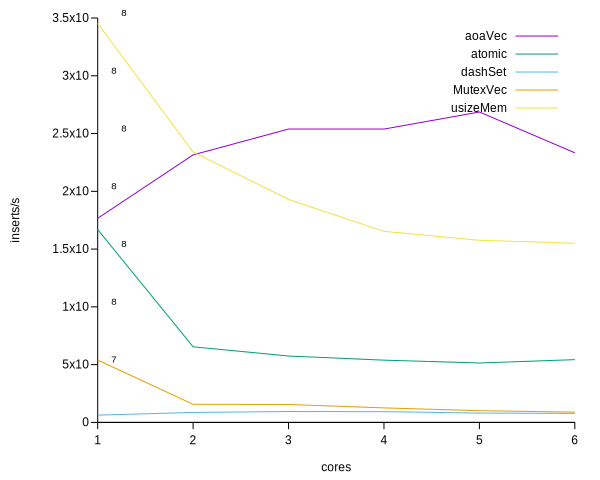

# concurrent_vec

This is my first (second) adventure into fast concurrency, specifically in rust.

## "Benchmarks"
To look at the Performance of different operations, here is a graph plotting them over the number of cores they are being run on.

